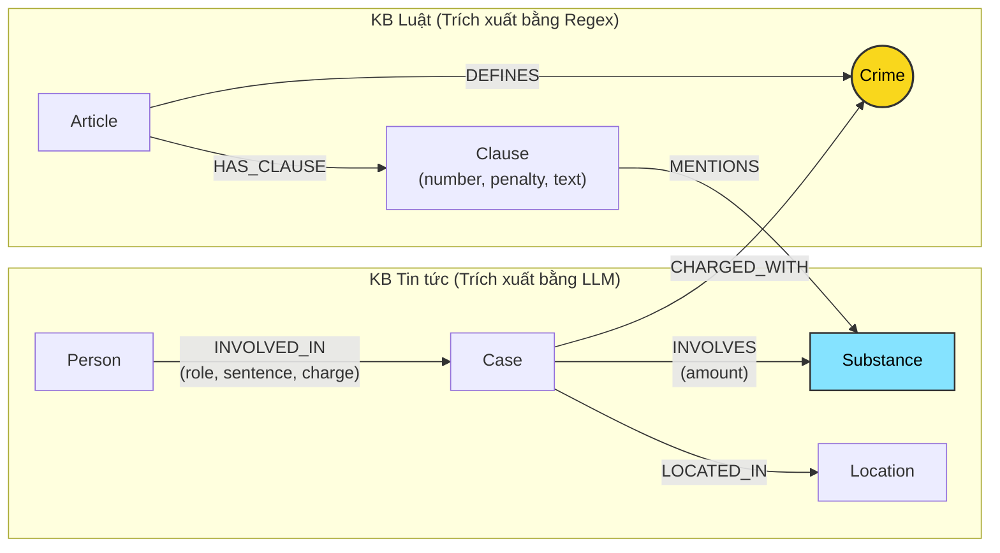

# Thiết kế Ontology — Day 19

**Họ tên:** Vũ Minh Hiếu  **MSSV:** 2A202602779

**Lựa chọn** (đánh dấu một):
- [x] Dùng ontology gợi ý (có tinh chỉnh và tối ưu hóa truy vấn)
- [ ] Tự thiết kế (xét bonus +15, xem `SUBMISSION.md`)

> Hướng dẫn: `LAB_GUIDE.md` Bước 2. Dùng ontology gợi ý thì vẫn phải điền đủ các mục dưới đây bằng lời của bạn.

---

## 1. Sơ đồ

Sơ đồ mô hình hóa mối quan hệ giữa hai cơ sở tri thức: **Văn bản pháp luật** (`data/drug_law/`) và **Tin tức báo chí** (`data/drug_news/`). Node cầu nối chính là `Crime` (Tội danh) và cầu nối phụ là `Substance` (Chất ma túy).

- **Node cầu nối chính:** `Crime` (Tội danh) – Nối giữa vụ án hình sự trong tin tức (`Case`) và Điều luật quy định tội danh đó trong Bộ luật Hình sự (`Article`).
- **Node liên kết phụ:** `Substance` (Chất ma túy) – Nối giữa chất xuất hiện trong vụ án (`Case`) và các chất được định lượng cụ thể trong từng khoản phạt của điều luật (`Clause`).

---

## 2. Entity types (node labels)

| Label | Ý nghĩa | Khóa định danh (`MERGE` theo) | Properties | Lấy từ KB nào | Trích bằng (regex / LLM / khác) |
| --- | --- | --- | --- | --- | --- |
| `Article` | Điều luật trong văn bản quy phạm pháp luật (BLHS hoặc Luật PCMT) | `id` (vd: `"Điều 251 BLHS"`) | `id`, `title`, `law`, `doc_id` | Luật | Regex |
| `Clause` | Khoản cụ thể của một Điều luật, chứa khung hình phạt và tình tiết định khung | `id` (vd: `"Điều 251 BLHS khoản 1"`) | `id`, `number`, `penalty`, `text`, `doc_id` | Luật | Regex |
| `Crime` | Tên tội danh pháp lý chuẩn hóa (node cầu nối liên kết luật và vụ án) | `name` (vd: `"mua bán trái phép chất ma túy"`) | `name` | Cả hai | Chuẩn hóa từ tiêu đề luật (Regex) & trích từ tin tức qua LLM + `link_entity` |
| `Substance` | Tên chất ma túy hoặc tiền chất | `name` (vd: `"MDMA"`, `"Heroine"`) | `name` | Cả hai | Từ điển canonical `SUBSTANCES` qua Regex (Luật) & LLM (Tin tức) |
| `Case` | Vụ án / vụ việc phạm tội được phản ánh trong bài báo | `name` (tên rút gọn do LLM gán) | `name`, `summary`, `date`, `doc_id`, `source_title` | Tin tức | LLM (Prompt có cấu trúc JSON) |
| `Person` | Cá nhân liên quan đến vụ án (bị can, bị cáo, đồng phạm, ...) | `name` (họ tên đầy đủ) | `name`, `aliases` | Tin tức | LLM |
| `Location` | Tỉnh/thành phố, địa phương diễn ra hành vi hoặc xét xử | `name` (tên địa phương) | `name` | Tin tức | LLM |

---

## 3. Relationships

| Type | Từ → Đến | Properties trên cạnh | Ý nghĩa |
| --- | --- | --- | --- |
| `DEFINES` | `Article` → `Crime` | *(không có)* | Điều luật quy định định nghĩa và chế tài cho tội danh tương ứng. |
| `HAS_CLAUSE` | `Article` → `Clause` | *(không có)* | Điều luật bao gồm các khoản quy định các khung hình phạt khác nhau. |
| `MENTIONS` | `Clause` → `Substance` | *(không có)* | Khoản luật viện dẫn hoặc quy định định lượng đối với loại chất ma túy cụ thể. |
| `CHARGED_WITH`| `Case` → `Crime` | *(không có)* | Vụ án bị cơ quan điều tra/viện kiểm sát/tòa án truy tố hoặc xét xử theo tội danh nào. |
| `INVOLVES` | `Case` → `Substance` | `amount` (khối lượng/tang vật) | Vụ án có liên quan/thu giữ chất ma túy nào với khối lượng bao nhiêu. |
| `LOCATED_IN` | `Case` → `Location` | *(không có)* | Vụ án xảy ra hoặc được đưa ra xét xử tại địa phương nào. |
| `INVOLVED_IN` | `Person` → `Case` | `role`, `sentence`, `charge` | Cá nhân đóng vai trò gì trong vụ việc, bị đề nghị/tuyên mức án và tội danh gì. |

---

## 4. Node cầu nối giữa 2 KB

- **Node nào:** Node `Crime` (Tội danh) là cầu nối trung tâm chính, kết hợp với `Substance` (Chất ma túy) làm cầu nối bổ trợ mức độ vi mô.
- **Vì sao chọn node này:**
  - Tin tức báo chí về pháp đình luôn đề cập đến tội danh khởi tố/tuyên án của các đối tượng (như *"mua bán trái phép chất ma túy"*, *"tổ chức sử dụng trái phép chất ma túy"*).
  - Bộ luật Hình sự (Chương XX) cấu trúc mỗi Điều luật xoay quanh đúng một tội danh cụ thể (ví dụ: Tiêu đề Điều 251 là *"Tội mua bán trái phép chất ma túy"*).
  - Do đó, `Crime` là điểm giao thoa ngữ nghĩa tự nhiên, duy nhất và mạnh mẽ nhất để đi từ một bị cáo/vụ án trong đời thực sang điều khoản pháp lý tương ứng.
- **Cách đảm bảo hai phía khớp tên:**
  - *Phía luật:* Tên tội danh được chuẩn hóa xác định (deterministic) thông qua hàm `normalize_crime`, loại bỏ tiền tố `"Tội "` hoặc `"tội "`, chuyển thành chữ thường và chuẩn hóa khoảng trắng thừa.
  - *Phía tin tức:* Đưa danh sách các tội danh hợp lệ đã biết (`known_crimes`) trực tiếp vào prompt để LLM ưu tiên chọn đúng định dạng nguyên văn. Sau khi LLM trả về, sử dụng hàm `link_entity`:
    1. Chuẩn hóa chuỗi cả 2 phía bằng `normalize_crime`.
    2. So khớp chính xác tuyệt đối (exact match).
    3. Nếu không khớp chính xác, áp dụng thuật toán so khớp gần đúng `difflib.get_close_matches` với ngưỡng `cutoff=0.8` để xử lý các biến thể chính tả phổ biến trong tiếng Việt (ví dụ: *"ma tuý"* vs *"ma túy"*).
- **Khi nào cầu gãy, và bạn xử lý thế nào:**
  - *Khi nào gãy:* Cầu gãy khi nhà báo dùng cách diễn đạt tự do không theo thuật ngữ pháp lý chuẩn (ví dụ: *"buôn bán hàng trắng"*, *"chơi ma túy tập thể"*, *"ôm đồ cấm"*), hoặc khi LLM trích xuất thiếu/sai trường tội danh, hoặc vụ án có nhiều tội danh đan xen mà LLM chỉ lấy một.
  - *Xử lý:*
    1. Dùng fallback cầu nối qua `Substance`: nếu không nối được qua `Crime`, vụ án vẫn nối tới `Substance`, từ đó tìm các `Clause` trong luật có nhắc tới chất đó.
    2. Khi so khớp thực thể, nếu độ tương đồng dưới 0.8 thì trả về `None` thay vì đoán sai (tránh nối nhầm sang tội danh khác gây hallucination nghiêm trọng).
    3. Kết hợp tìm kiếm song song các Điều luật được nhắc tên trực tiếp trong câu hỏi (regex `[Đđ]iều (\d+)`).

---

## 5. Competency questions

| Câu | Đường đi (Cypher pattern) | Trả lời được? |
| --- | --- | --- |
| **Q1** (single-hop-law: Tiền chất là gì theo Luật PCMT 2021) | `(:Article {id: "Điều 2 Luật PCMT 2021"})-[:HAS_CLAUSE]->(cl:Clause)` | **Có**: Graph lưu nội dung text của từng khoản thuộc các điều luật định nghĩa, vector search và đồ thị kết hợp lấy ra định nghĩa hoàn chỉnh. |
| **Q2** (single-hop-news: Bị cáo lãnh án tử hình vụ 36kg) | `(p:Person)-[r:INVOLVED_IN]->(k:Case)` (với `r.sentence CONTAINS 'tử hình'`) | **Có**: LLM trích xuất rõ vai trò và mức án của từng bị cáo (`Trần Thanh Tuấn`, `Trần Minh Tâm`) trên cạnh `INVOLVED_IN`. |
| **Q3** (cross-kb: Lê Minh Thành án phạt, tội gì, Điều nào, khung cơ bản) | `(:Person {name: 'Lê Minh Thành'})-[:INVOLVED_IN]->(k:Case)-[:CHARGED_WITH]->(c:Crime)<-[:DEFINES]-(a:Article)-[:HAS_CLAUSE]->(cl:Clause {number: 1})` | **Có**: Đi xuyên 2 KB qua cầu nối `Crime`: từ Người → Vụ án → Tội danh → Điều 251 BLHS → Khoản 1 (khung cơ bản 2 - 7 năm). |
| **Q4** (cross-kb: Hoàng Nato hành vi gì, mức phạt tối đa) | `(:Person)-[:INVOLVED_IN]->(k:Case)-[:CHARGED_WITH]->(c:Crime)<-[:DEFINES]-(a:Article)-[:HAS_CLAUSE]->(cl:Clause)` (với Person có `name` hoặc `aliases` chứa `"Hoàng Nato"`) | **Có**: Nối từ biệt danh sang Tội danh (*tổ chức sử dụng trái phép chất ma túy*) → Điều 255 BLHS, duyệt các khoản của Điều 255 để tìm khung cao nhất (chung thân). |
| **Q5** (cross-kb-multi-hop: Cái Quang Huy tội gì, chất gì, khoản nào, khung phạt) | `(:Person {name: 'Cái Quang Huy'})-[:INVOLVED_IN]->(k:Case)-[:CHARGED_WITH]->(c:Crime)<-[:DEFINES]-(a:Article)-[:HAS_CLAUSE]->(cl:Clause)-[:MENTIONS]->(s:Substance)` kết hợp `(k)-[:INVOLVES]->(s)` | **Có**: Đi 4 chặng: Người → Vụ án (có chất MDMA, khối lượng 9,6kg) → Tội vận chuyển (Điều 250) → Khoản 4 (định lượng MDMA từ 100g trở lên: tù 20 năm, chung thân hoặc tử hình). |
| **Q6** (aggregation: Những vụ việc nào liên quan đến MDMA) | `(k:Case)-[:INVOLVES]->(:Substance {name: 'MDMA'})` | **Có**: Gom nhóm tất cả các node `Case` có cạnh `INVOLVES` trỏ tới node `Substance {name: 'MDMA'}`. |

---

## 6. Quyết định thiết kế và đánh đổi

### Quyết định 1: Dùng Regex thay vì LLM để trích xuất văn bản Luật
- **Đã chọn:** Dùng regular expressions và phân tích cấu trúc Markdown để bóc tách `Article`, `Clause`, `Substance`.
- **Phương án khác:** Dùng LLM đọc toàn bộ văn bản luật và sinh ra JSON các node và relationship.
- **Vì sao chọn:** Văn bản luật pháp Việt Nam có cấu trúc cực kỳ quy chuẩn và nhất quán (Điều → Khoản số → Điểm chữ cái). Regex chạy tức thời (<0.1 giây), chi phí 0 USD, và bảo đảm tính tất định 100% (không bao giờ hallucinate hay bỏ sót khoản phạt).

### Quyết định 2: Đặt `sentence` và `role` trên cạnh `INVOLVED_IN` thay vì tạo node riêng
- **Đã chọn:** Thuộc tính `sentence` (mức án) và `role` (vai trò) được lưu trực tiếp trên relationship `(:Person)-[:INVOLVED_IN]->(:Case)`.
- **Phương án khác:** Tạo node riêng `Sentence` hoặc `Verdict`.
- **Vì sao chọn:** Một người có thể tham gia nhiều vụ án với vai trò và mức án khác nhau trong từng vụ. Đặt thuộc tính trên cạnh phản ánh đúng ngữ nghĩa phụ thuộc ngữ cảnh của vụ án, giữ đồ thị gọn gàng, giảm số lượng node và tăng tốc độ truy vấn Cypher.

### Quyết định 3: Thiết kế 2 tầng lọc dữ kiện đa bước trong `Neo4jGraph.context`
- **Đã chọn:** Chỉ lấy khoản 1 (khung cơ bản) và các khoản có `MENTIONS` chất mà chính vụ án đó `INVOLVES` (hoặc câu hỏi đề cập).
- **Phương án khác:** Lấy toàn bộ tất cả các khoản của Điều luật liên quan đưa vào prompt.
- **Vì sao chọn:** Nhiều Điều luật (như Điều 251, 250) có tới 4-5 khoản rất dài với hàng chục điểm a, b, c... Nếu đưa hết vào context, prompt sẽ bị phình to dẫn đến lãng phí token, tăng chi phí và dễ làm LLM bị nhiễu thông tin (lost in the middle). Việc lọc theo chất thu hẹp chính xác khung hình phạt áp dụng cho vụ án cụ thể.

---

## 7. So với ontology gợi ý (bắt buộc nếu xét bonus)

- **Lựa chọn:** Bài làm sử dụng nền tảng **ontology gợi ý chuẩn** và bổ sung cơ chế kiểm soát chất lượng dữ liệu:
  - Tối ưu hóa hàm `link_entity` với khả năng xử lý khoảng trắng, dấu tiếng Việt và ánh xạ ngược chính xác về tên chuẩn trong danh mục.
  - Tích hợp thêm truy vấn bắt trực tiếp số Điều luật từ câu hỏi bằng Regex trong hàm `context` để hỗ trợ song song cả câu hỏi truy vấn trực tiếp luật và câu hỏi multi-hop xuyên tin tức.
  - Lọc chính xác các `Clause` dựa trên giao điểm giữa chất của vụ án (`INVOLVES`) và chất quy định trong khoản luật (`MENTIONS`).

---

## 8. Hạn chế còn lại

1. **Khóa định danh của `Case` và `Person` dựa trên chuỗi tên:** Nếu hai bài báo viết về cùng một người nhưng một bài viết *"Lê Minh Thành"* và một bài viết tắt hoặc có lỗi chính tả nhẹ, đồ thị sẽ tạo 2 node riêng biệt thay vì gộp chung (Entity Resolution chưa hoàn hảo).
2. **Chưa phân tích ngữ nghĩa ngưỡng khối lượng tự động bằng code:** Graph chỉ lưu chuỗi số lượng trên cạnh `amount` (ví dụ `"hơn 9,6kg"`), việc so sánh số lượng này rơi vào khung nào trong các điểm của `Clause` (ví dụ điểm b khoản 4: từ 100g trở lên) vẫn phụ thuộc vào năng lực suy luận số học của LLM ở bước trả lời.
3. **Chưa mô hình hóa các giai đoạn tố tụng:** Bản án sơ thẩm, phúc thẩm, kháng cáo kêu oan hiện cùng được gắn vào một node `Case`, chưa phân tách lịch sử thay đổi mức án qua các cấp xét xử.
